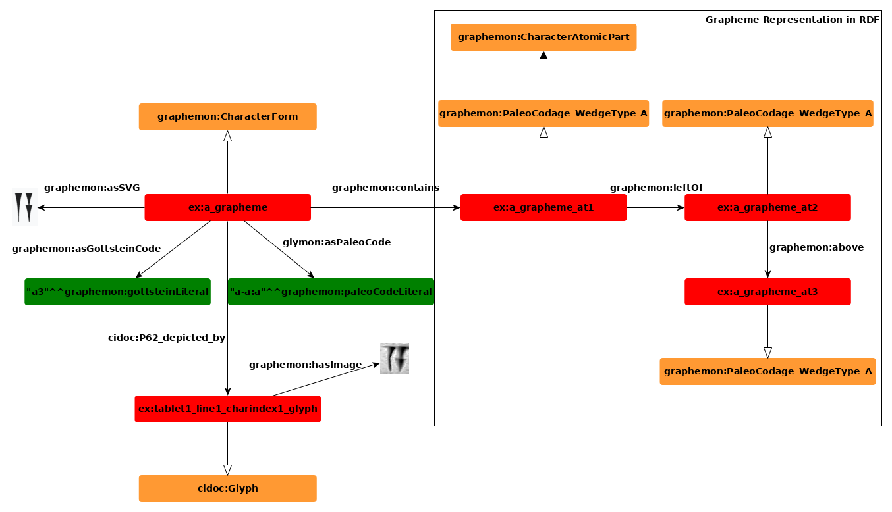
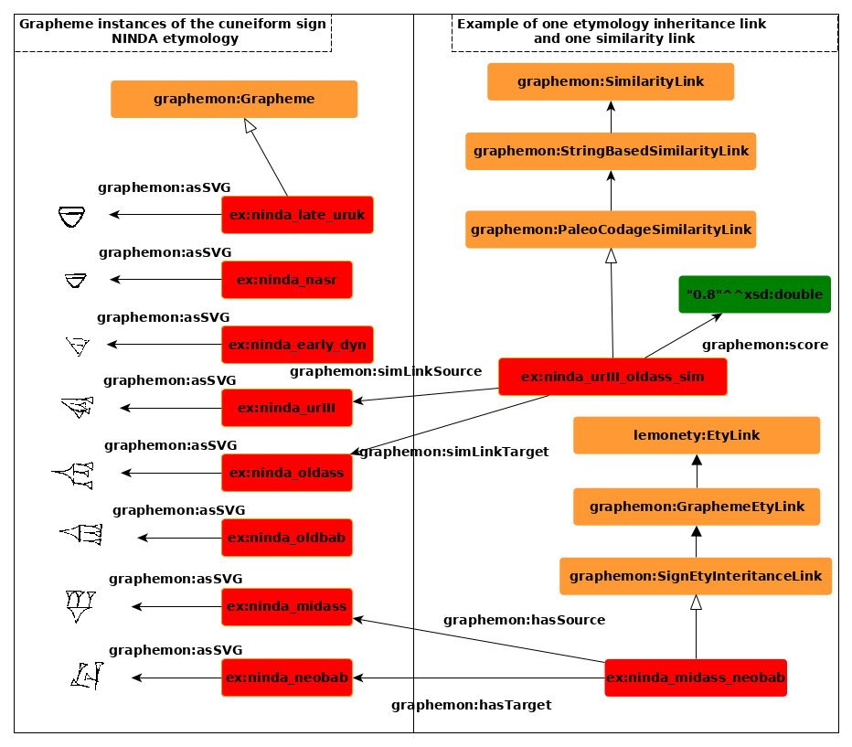

# Graphemon - Grapheme Model for ontologies
This repository contains a complimentary ontology model to the Ontolex-Lemon model for dictionaries.
Its goal is the representation of grpahemes and grapheme variants and the connection of these variants to actual representations of graphemes, e.g. glyphs on given mediums.
Documentation: https://situx.github.io/graphemon/

# Foundations
To explain the core of the ontology model, the following fundamental concepts should be explored:
* **Glyph**: A physical representation of a written script as defined by the CIDOC CRMtex extension
* **GraphemeVariant**: A variant of a normalized form of a set of Glyphs
* **Grapheme**: The description of a set of GrapheVariants which share a common identifier such as a Unicode code point or dictionary entry
* **GraphemeManifestiation**: Superclass of Grapheme and GraphemeVariant: A manifestation of a grapheme in a written or non-written form

Each Grapheme is expected to be assigned a GraphemVariant which should be marked as the canonical or standard grapheme variant.
This variant might be defined by a community of scholars or it might be inferred by an algorithm (e.g. the most occurring grapheme variant could be classified as the canonical variant)
The method of detection of a canonical variant should be documented in the vocabulary.

It also should be noted that defining cnonical Grapheme vs. the GraphemeVariants is a script-dependent and usually not a language-dependent task.

For example: In the cuneiform script, we consider a Grapheme a new Graphemvariant if
* it depicts the same meaning as the canonical Grapheme
* adds or removes cuneiform wedges in comparison to the canonical form
* shifts the order or position of wedges as compared to the canonical Grapheme

The nature of these definitions need to be adjusted by language, possibly be individual scholars.

# Graphemon Ontology Model

## Representation of grapheme variants
Grapheme variants might be representated in the following different ways:
* Using a description model for graphemes for a particular script (e.g. PaleoCodage, Gottstein, Chinese Character Description Language)
* Using an image representation for a particular script (e.g. SVG)
* Using related representations such as a 3D volume of a written grapheme

A description in at least two of the aforementioned representations allows for the calculation of similarities between grapheme variants and their expression in RDF.

For grapheme description models: These may also be expressed directly in RDF triples.

## GraphemeVariant Etymology

Similar to the representation of [lemonETY](https://github.com/anasfkhan81/lemonEty), this ontology model supports to model etymology relations of grapheme variants.

### Similarity of GraphemeVariants

GraphemeVariants can be distinguished by etymological relations (on a semantic level), but can also be related by similarity metrics targeting the appearance of either the Grapheme shape or description or the glyph shape or representation.
For example, to distinguish cuneiform signs, one may use image similarity measurements on representations of Graphemes in PNG or SVG and may choose String similarity metrics to highlight differences on String descriptions such as character description languages.
Results of these similarity calculations can be added as relations in the ontology model.

# Relation to existing ontology models

## Relation to the Ontolex-Lemon model

The Ontolex-Lemon model contains definitions for the following items we relate to:
* LexicalForm/Word: A lexical form which is defined in a Lexicon
* LexicalSense: A lexical sense which is associated with a Word: We define a derived GraphemeSense

We add:
* WordFormOccurrence: A word form which is composed out of defined grapheme variants which are at best related to representations on physical media.
* Properties to relate WordFormOccurrences to Graphemes and Grapheme Variants 

## Relation to the CIDOC-CRM CRMtex model

This ontology model as interlinks to the CIDOC-CRM CRMtex model (https://cidoc-crm.org/crmtex/fm_releases).

CIDOC-CRM CRMtex in particular specifies the following classes we connect to:
* Glyph: A physical representation of an occurrence of a grapheme on a medium
* Grapheme: A general grapheme classification
* Properties relating Graphemes to Glyphs

We add a better description and decomposition of graphemes, grapheme parts, atomic parts and etymology in the Graphemon Ontology model.

## Relation to the W3C Web Annotation Data Model

The W3C Web Annotation Data Model is a linked-data based annotation standard for image and text media. (https://www.w3.org/TR/annotation-model/)

The model can be used to annotate images of cuneiform tablets to annotate e.g. occurrences of cuneiform signs.

Our ontology model allows to relate these image annotations to defined identifiers of graphemes and grapheme variants.

# Usage examples of the ontology model

This repository highlights two usage examples of the ontology model using the cuneiform language. The first example represents two cuneiform words and their grapheme variants, the second example higlights the relationship of two grapheme variants.

## Representation example: Cuneiform word "A" vs. Cuneiform word 2(disz)

File: https://github.com/situx/graphemon/blob/main/examples/cuneiform_a_example.ttl

The cuneiform word "A", with a sense of water consists of exactly one grapheme, "A", which may be depicted in at least two grapheme variants which may occur as glyph instances on certain cuneiform tablets.
Using the ontology model, these relations can be described.
In addition, we can relate the two grapheme variants of cuneiform sign A in an etymological context, as we know that these grapheme variants tend to occur at different points in time.
We can contrast these etymological statements with String similarity statements based on the PaleoCodage encoding to answer questions such as:
* How similar are etymologically related grapheme variants on a descriptive level?

## Relationship between Graphemes: Cuneiform Grapheme "A" is part of Grapheme AxA

File: https://github.com/situx/graphemon/blob/main/examples/cuneiform_a_example.ttl

This example highlights the vocabulary of relations between two graphemes. Given a Grapheme one, this Grapheme might be included in another grapheme.

The example which highlights this relation is the example of the cuneiform sign "A" which is included in the cuneiform sign "AxA".

# Application of the ontology model

While we concepted the ontology model for the usage for modeling cuneiform graphemes, our goal was to keep the ontology so general that it can be applied to other languages as well. The following applications may also be performed on other language corpora.

## Creation of machine learning resources

The ontology model may be used to query targeted data to create machine learning datasets based on glyphs.
Answers to queries such as:
* Give me all sign variants of sign "A" from an OldBabylonian time period from photos and 3D renderings?
* Give me all sing variants which are similar to grapheme variant 2 of sign "A"?

can help greatly when gathering data for appropriate machine learning tasks.

## Sign variant registries based on linked data

Especially in cuneiform studies, but also as an interesting application for other scripts, an overview of all sign variants across space and time is essential for researchers to draw the right conclusions when interpreting a text.
* When and where did this grapheme variant occur?
* Which grapheme variants are similar to the current grpaheme and on which text mediums did they occur? Are there example images?

Example: https://situx.github.io/PaleoCodage/

The Graphemon model will allow to answer these questions to scholars, as answers to these questions can be queried from the setup of the ontology model.

# Applicability to other scripts

Ideas for application:
* Egyptian Hieroglyphics
* Ogham Script

